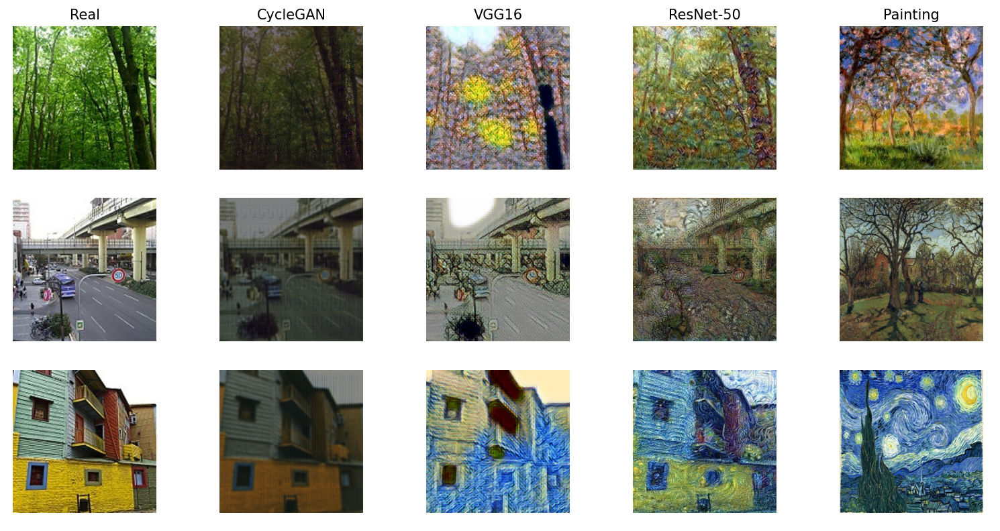

## **`Paint like Your Favourite Artist  : Image Style Transfer using CycleGAN,Resnet50 and VGG16`**

### Description 
Style Transfer is a technique in computer vision and graphics that involves generating a new image by combining the content of one image with the style of another image. The goal of style transfer is to create an image that preserves the content of the original image while applying the visual style of another image. Any image can be turned into a painting drawn by any artist, using one of his/her painting to transfer the style into the picture. We explored neural style transfer models VGG16 and Resnet-50, and GAN Models (Cycle GAN) to produce painting.

---
### Training
Training is done by using perceptual loss. The output from the decoder is passed to VGG from which we extract features and calculate style loss and content loss. Then we calculate perceptual loss from the weighted sum of Style loss and content loss. For content loss, higher layers are used. For style loss, lower layers of networks are used. In defining our loss functions according to our content and style image shapes, we utilized the Gram Matrix by which we could obtain the MSE loss between content and style images. With the default number of epochs of 10, content image weight of 20, and style image weight of 100 and total variation weight = .004, total time spent on training is around 2 hours each time with a style image. We used a learning rate of 0.0002 with 15 epoch.

---

  
   
  <em>Fig 1 : Result Generated by models</em>

Paintings by Monet (Giverny in springtime), Pissarro (Chestnut trees, Louveciennes, Spring - 1870), and Van Gogh(Starry Night) are used for image style transfer.

---

### Evaluation Metrics 
  - FID : Fréchet Inception Distance (FID) compares the feature representations of images extracted from a pre-trained deep convolutional neural network, typically Inception-v3, trained on a large dataset.
  - PSNR : PSNR metric is expressed in decibels (dB) and is computed using the mean squared error (MSE) between the original and reconstructed images.
  - SSIM : SSIM operates by comparing local patterns of pixel intensities in the reference and distorted images.

---

### Authors : 
  - Ayesha Binte Mostofa (1805062)
  - Md. Mahmudul Hasan   (1805084)
### Supervisor :
  - Sheikh Azizul Hakim , Lecturer of CSE,BUET
    
---

For details, please read our [Project Report](https://github.com/ayeshathoi/Image-Style-Transfer-using-CycleGAN-Resnet50-VGG16---Paint-like-Your-Favourite-Artist/blob/main/Project_Report_Image_Style_Transfer.pdf)
